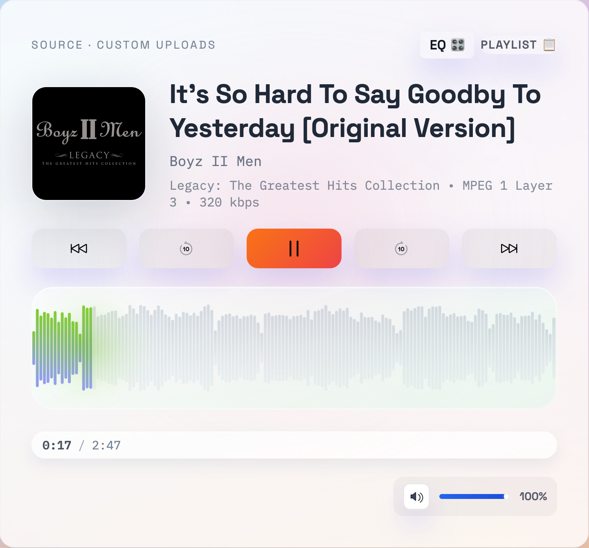
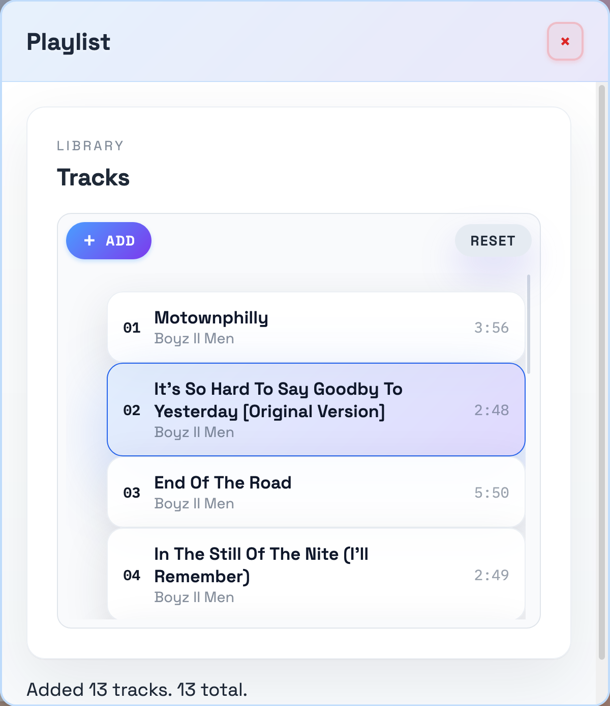
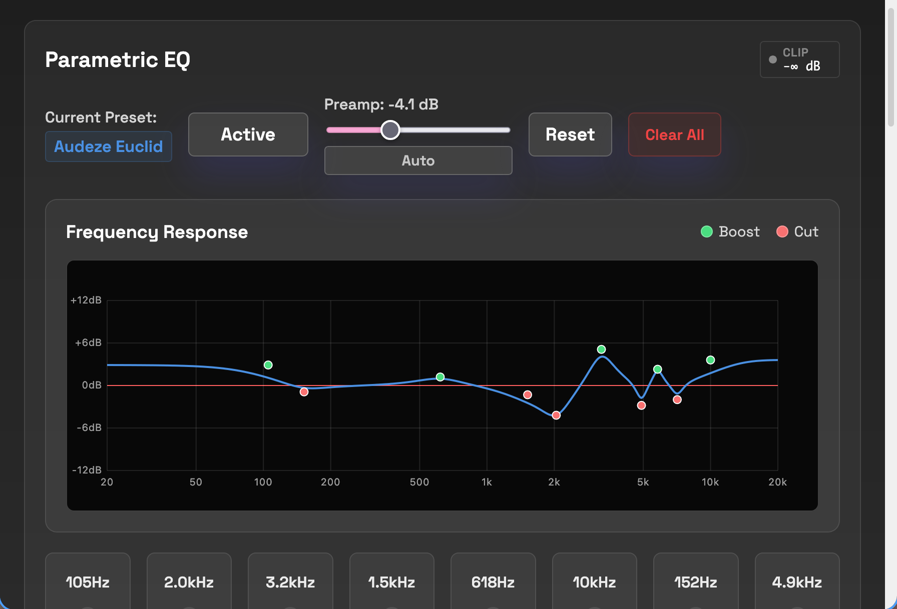
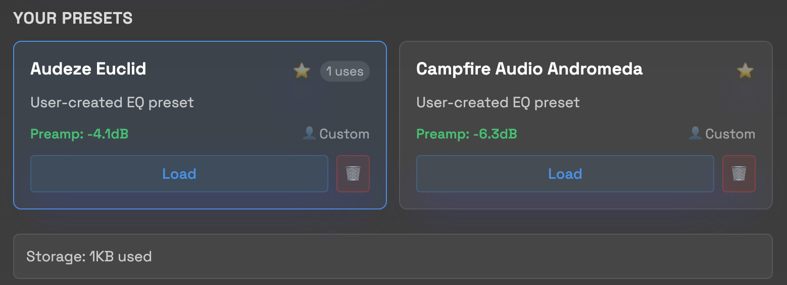

# [Saku Audio Player](https://seungkilee-cs.github.io/saku-audio-player/)

> 咲く, Let your music bloom

A web-based audio player with autoEq compatible 10 band parametric equalizer, built with Reactjs.

## Screenshots

### Playser

|                   Audio Player                   |                       Playlist                       |
| :----------------------------------------------: | :--------------------------------------------------: |
|  |  |

### PEQ




[Live Demo](https://seungkilee-cs.github.io/saku-audio-player/)

## Motivation

I move between multiple development environments and rotate through different headphones, which means every listening session wants a new parametric EQ workflow. On Windows I rely on Equalizer APO. On macOS I juggle BlackHole and host AU. When I fall back to DAC control panels like Qudelix or FiiO I lose the moment I leave that hardware behind. The constant swapping wastes time and fractures the experience.

Saku Audio Player is born to scratch that itch for me. I wanted something that never asks for an installer, a login, or a network round trip. My music library is synced on NAS and accessible for me in my machines, or in a usb drive, and Saku lets me bring my own music, process everything with client side tools, and keep every decibel adjustment private to the browser. 

Building it showed another gap as well. The npm ecosystem still lacks a light 10-band PEQ library, so this project is the path toward modularizing the equalizer and packaging it for others. The same code will power a browser extension that can import AutoEQ ParametricEQ presets and apply a real 10-band curve anywhere.

In a world where access keeps drifting toward subscriptions and remote servers, I would rather keep the listening chain local. Saku is a bring your own music solution that puts control of the audio stack back in the listener’s hands.

## Features

### Audio Playback

- High-quality audio playback with Web Audio API
- Support for MP3, FLAC, M4A, WAV, AAC, OGG formats
- Drag and drop audio file import
- Waveform visualization with scrubbing
- Volume control with mute functionality
- Track navigation and playlist management

### Parametric Equalizer

- 10-band parametric EQ with real-time processing
- Professional frequency response visualization
- Auto-preamp calculation to prevent clipping
- Real-time clipping monitor with visual feedback
- EQ bypass toggle for A/B comparison

### Preset Management

- Comprehensive preset library system
- AutoEQ compatibility with ParametricEQ.txt import/export
- Multiple export formats: JSON, AutoEQ text, PowerAmp XML, Qudelix JSON
- Local storage persistence
- Preset deletion with confirmation dialogs

### User Interface

- Responsive design with modal interfaces
- Dual theme system (light for playlist, dark for EQ)
- Comprehensive keyboard shortcuts for power users
- Mobile-friendly touch controls
- Accessibility compliant interface

## TODO

### UX

- [x] UI Clean up and Consistency

  - [x] Font consistency
  - [x] PEQ Panel theme consistency and font consistency
  - [x] Playlist margin and track item handling

- [ ] UX Revamp for more consistent experience on both Mobile and Browser

  - [x] playlist responsive
  - [x] PEQ responsive
  - [ ] Panel Control Mobile support
  - [x] Keyboard shortcut modal
  - [ ] Player responsive (vertical)

- [ ] Memory leak testing and optimization

### Features

- [ ] Playlist management enhancements

  - [ ] remove individual track
  - [ ] drag and move track order
  - [x] Repeat modes (currently repeat all by default)

- [ ] Consolidate PEQ import

- [ ] AutoEq Search Integration

  - [ ] [Oratory1990](https://github.com/jaakkopasanen/AutoEq/tree/master/results/oratory1990) integration
  - [ ] General AutoEq.app integration

### Expansions

- [ ] Mobile Support

- [ ] Streaming Service Integration
  - [ ] YT Music
  - [ ] Spotify
- [ ] Browser Extension Integration

  - [ ] Chrome / Edge / Brave
  - [ ] Firefox / Zen

- [ ] PEQ modularization
  - [ ] Extract PEQ to a separate library
  - [ ] Typescript support

- [ ] Electron App for Desktop usage

## Keyboard Shortcuts

### Playback and Navigation

- Arrow Left: Skip backward 10 seconds 
- Arrow Right: Skip forward 10 seconds 
- Arrow Up/Down: Volume up/down
- A: Add track to playlist
- B: Previous track
- N: Next track
- M: Mute/unmute (preserves volume level)
- Space: Play/pause
- E: Open/close EQ panel 
- P: Open/close playlist panel 

### EQ Controls

- Shift + Arrow Keys: Navigate EQ presets
- T: Toggle EQ bypass
- R: Reset EQ to flat response
- Esc: Close modals (save preset, keyboard shortcuts)

## Getting Started

### Development Setup

1. Clone the repository

```bash
git clone https://github.com/seungkilee-cs/saku-audio-player.git
cd saku-audio-player
```

2. Install dependencies

```bash
npm install
```

3. Start development server

```bash
npm run dev
```

4. Open http://localhost:5173 in your browser

### Building for Production

```bash
npm run build
```

The built files will be in the `dist` directory.

### Deployment

```bash
npm run deploy
```

Deploys to GitHub Pages using the configured homepage URL.

## Usage

### Basic Playback

1. Drag audio files onto the player or use the playlist modal to add tracks
2. Use playback controls or keyboard shortcuts to control audio
3. Adjust volume with the volume slider or arrow keys

### Using the Equalizer

1. Press E or click the EQ button to open the parametric equalizer
2. Adjust frequency bands by dragging sliders or entering precise values
3. Use presets from the dropdown or import your own AutoEQ files
4. Toggle bypass with T key to compare processed vs unprocessed audio
5. Monitor the clipping indicator to avoid distortion

### Importing EQ Presets

1. Open the EQ modal and click Import
2. Select files in supported formats:
   - AutoEQ ParametricEQ.txt files
   - JSON preset files
   - PowerAmp XML files
   - Qudelix JSON files
3. Presets are automatically saved to your local library

### Getting AutoEQ Files

AutoEQ provides scientifically measured EQ presets for thousands of headphones and earphones. Here's how to get them:

#### Method 1: Direct Download from AutoEQ Database

1. Visit the [AutoEQ Results Repository](https://github.com/jaakkopasanen/AutoEq/tree/master/results)
2. Navigate to your headphone manufacturer folder
3. Find your specific headphone model
4. Download the `ParametricEQ.txt` file from the model folder
5. Import the file directly into Saku Audio Player

#### Method 2: Using AutoEQ Web Interface

1. Go to [AutoEQ.app](https://autoeq.app/) (if available)
2. Search for your headphone model
3. Download the parametric EQ file in json
4. Import into Saku Audio Player

#### Method 3: Generate Custom EQ with AutoEQ Python Tool

1. Install AutoEQ: `pip install autoeq`
2. Obtain frequency response measurements for your headphones
3. Run AutoEQ to generate compensation curve:
   ```bash
   python -m autoeq --input_dir=measurements --output_dir=results
   ```
4. Use the generated `ParametricEQ.txt` file

#### File Format Requirements

AutoEQ ParametricEQ.txt files should contain lines like:

```
Filter 1: ON PK Fc 105 Hz Gain -2.1 dB Q 0.7
Filter 2: ON PK Fc 2300 Hz Gain -1.8 dB Q 2.0
Preamp: -2.1 dB
```

Saku Audio Player automatically parses these files and converts them to the internal format.

### Exporting EQ Presets

1. Configure your desired EQ settings
2. Click Export in the EQ modal
3. Choose your preferred format
4. Save the file for use in other applications

## Technical Details

### Architecture

- Built with React 19 and Vite
- Web Audio API for real-time audio processing
- Context-based state management
- Local storage for preset persistence

### Audio Processing

- 10-band parametric EQ using BiquadFilterNode
- Real-time frequency response calculation
- Automatic preamp adjustment to prevent clipping
- AnalyserNode-based clipping detection

### Browser Compatibility

- Chrome 66+ (recommended)
- Firefox 60+
- Safari 14+
- Edge 79+

### Performance

- Less than 1% CPU overhead for EQ processing
- Responsive design for Web and mobile view
- Efficient memory usage with cleanup on component unmount

## License

GPL3 License. See the repository for license details.

## Acknowledgments

- AutoEQ project for headphone measurement data compatibility
- PowerAmp android app for the inspiration
- Web Audio API community for technical guidance

