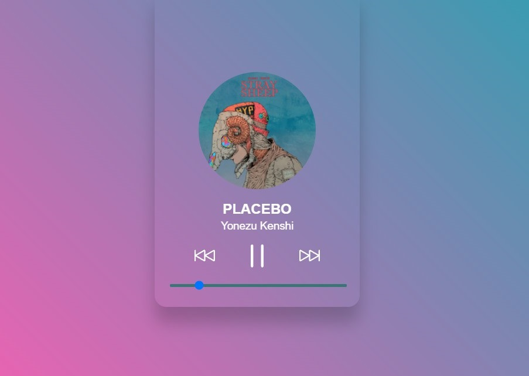

# [咲く] Saku Audio Player
咲く: Let the Sound Bloom

Static Audio Player

[Demo Here](https://seungkilee-cs.github.io/saku-audio-player/)

## 

## To Do
### Short Term
- [ ] Player Reposition
- [x] ~~Deploy the app to be static player~~
- [ ] Add Time Display (Start, Current, End)
- [ ] Add Volume Control
- [ ] Add Playlist Visibility
- [ ] Add file format display
- [ ] Add True Bit-Rate display
- [ ] Add Header/Footer
- [ ] Add URL Support

### Mid Term
- [ ] Add "Add/Delete Music" Functionality
- [ ] Re-design the UI for web
- [ ] Add Library Feature
- [ ] Electron Port
- [ ] React Native Port
- [ ] Add a Minimized View
- [ ] Cache and Clear Optimization

### Long Term
- [ ] Add PEQ feature
- [ ] Add EQ Preset feature
- [ ] Add EQ Import / Export
- [ ] Add Lyric Display
- [ ] Add Spectrum Analyzer